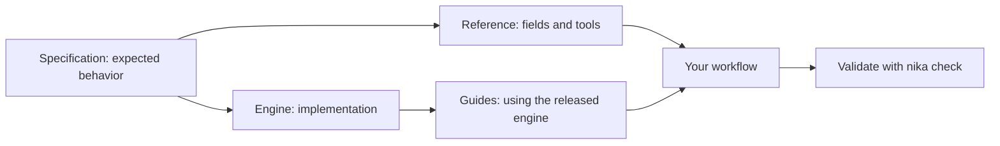

Nika's documentation teaches you how to write workflows and use the engine.
When you need to check a precise behavior, follow the reference to its source
and compare it with the version you have installed.

## Which source answers your question?

| Your question | Start here | What it establishes |
| --- | --- | --- |
| How do I write my first workflow? | [First workflow](/getting-started/first-workflow) | A complete example to validate and run |
| What does a YAML field mean? | [Language reference](/reference/language/overview) | Its type, placement and declared behavior |
| What arguments does a tool accept? | [Builtins](/reference/builtins) | Its contract, permissions and errors |
| What is available in my installation? | `nika --version` and `nika catalog --tools --json` | The installed version and tool catalog |
| How does the engine implement a feature? | [Architecture](/concepts/architecture) and [engine source](https://github.com/supernovae-st/nika) | The implementation and its interfaces |
| How do I use Nika from an application? | [SDK overview](/sdk/overview) | Client setup and application integration |
| Why did a workflow fail? | [Error codes](/reference/error-codes) and [traces](/concepts/traces) | The diagnostic and evidence from that execution |

## Contract, implementation and explanation

The [specification](https://github.com/supernovae-st/nika-spec) defines the
language contract, schemas and conformance fixtures. The
[reference engine](https://github.com/supernovae-st/nika) implements that
contract. These guides explain how to use it. The [product website](https://nika.sh)
introduces Nika; keep documentation bookmarks on `docs.nika.sh`.

A schema declaration describes a contract. It does not, by itself, prove that
an installed binary implements that behavior. Check [engine status](/reference/status)
and validate your complete workflow before running it.

## Read the version with the example

Generated field and builtin references link to a specific specification revision.
A Git revision identifies the exact source used for the explanation. Schema
pointers locate the declaration inside that source file.

For example, a field can be allowed in several places with different requirements.
Read the **Meaning and placement** section for the object you are editing;
a shared field name does not mean it is valid everywhere.

<Note>
  A source excerpt is a fragment. Its surrounding tasks, inputs and permissions
  may be omitted. Use a [complete example](/examples/overview) or
  [template](/guides/templates) when you need a runnable starting point.
</Note>

## What verification tells you

| Evidence | What you can conclude | What you still need to check |
| --- | --- | --- |
| A source revision and matching content hash | The reference uses the identified source | Whether that source is the latest version |
| A schema declaration | The field is defined at that location | Support in your installed engine |
| A successful `nika check` | The workflow passed validation | The result of actually running it |
| A recorded trace | What happened in that execution | Whether a different input behaves the same way |

For an integration, prefer the [versioned machine interfaces](/reference/machine-surfaces)
to parsing prose. For documentation used by an agent, start with the
[documentation index](https://docs.nika.sh/llms.txt).

If an explanation and your installed version disagree, report the page URL,
`nika --version`, a minimal example and the diagnostic in a
[documentation issue](https://github.com/supernovae-st/nika-docs/issues).
Remove credentials and personal data from your example before sharing it.
